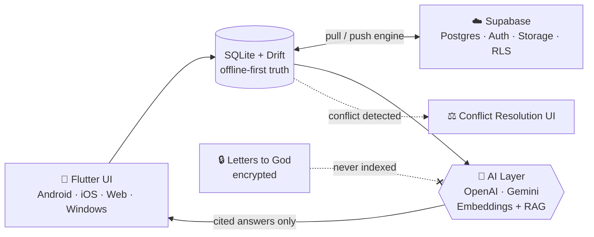
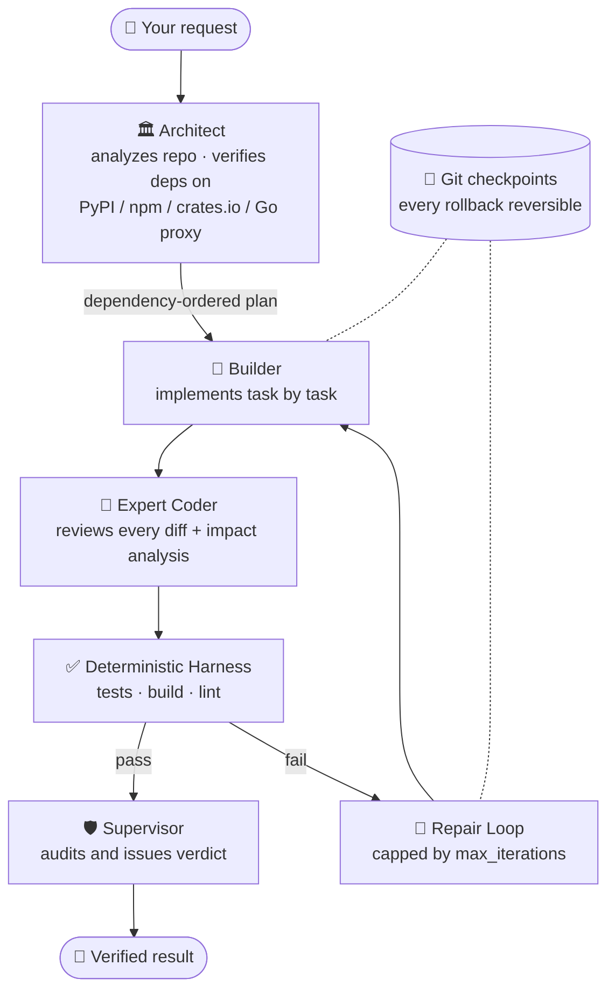

<div align="center">


[](https://github.com/B-max12)

<br>

<a href="https://github.com/B-max12"></a>
<a href="https://www.linkedin.com/in/awab-hammad-128aa4300"></a>
<a href="mailto:awabbhammad8@gmail.com"></a>
<a href="https://awab.lovable.app"></a>

<br><br>


</div>

---

## 🧬 `whoami`

```rust
struct Awab {
    handle:     &'static str,   // "B-max12"
    builds:     [&'static str; 3],
    obsessions: Vec<&'static str>,
    philosophy: &'static str,
}

const AWAB: Awab = Awab {
    handle: "B-max12",
    builds: ["Dear Diary", "AURELIS", "FORGEX"],
    obsessions: vec!["local-first", "verification", "privacy by architecture", "details nobody notices"],
    philosophy: "Code is poetry written for machines ✨",
};
```

> **Three projects. Three different worlds.**
> A diary that remembers you, a download manager that respects you, and an AI engineering team that checks its own work.

---

## 🚀 Flagship Projects

<table>
<tr>
<td align="center" width="33%">
<h3>📖 Dear Diary</h3>
<sub><b>Your Vintage Journal</b></sub><br><br>


<br><br>
<a href="#-dear-diary">Jump to details ↓</a>
</td>
<td align="center" width="33%">
<h3>⬇️ AURELIS</h3>
<sub><b>Downloads, refined.</b></sub><br><br>


<br><br>
<a href="#%EF%B8%8F-aurelis">Jump to details ↓</a>
</td>
<td align="center" width="33%">
<h3>🔨 FORGEX</h3>
<sub><b>Plan. Build. Refine. Verify.</b></sub><br><br>


<br><br>
<a href="#-forgex">Jump to details ↓</a>
</td>
</tr>
</table>

---

## 📖 Dear Diary

### *A private, offline-first diary that turns daily journaling into an intelligent memory system.*

Write on a vintage notebook with ruled lines, paper themes and ink colors, then let an AI layer help you *remember* your own life, without ever betraying your privacy.

<table>
<tr>
<td width="50%" valign="top">

#### ✍️ The Writing Experience
- Rich-text entries on a **vintage notebook UI**
- Paper themes, ruled lines, custom ink colors
- Photos as compact **inline blocks**
- **Voice notes** with playback
- Monthly calendar with entry activity and moods

#### 🌅 Daily Life Tools
- Mood tracking and custom categories
- Routine task management with **streaks**
- Daily reflections: philosopher quotes, puzzles, Quran verses with verified translations
- Statistics dashboard: writing patterns, streaks, mood distribution

</td>
<td width="50%" valign="top">

#### 🧠 The AI Layer
- **Semantic search** across every entry
- Diary analysis with caching
- A chatbot that answers **with entry citations**
- **Anti-hallucination** guardrails
- Explicit **user confirmation** before any edit or deletion

#### 🔐 Privacy First
- Private *Letters to God* are **encrypted separately**
- Excluded from all AI, search and statistics
- **App Lock** with PIN protection
- Offline-first: your device is the source of truth

</td>
</tr>
</table>



<p>


</p>

---

## ⬇️ AURELIS

### *"Downloads, refined."*

A **production-grade, local-first download manager** for Windows, macOS and Linux, built from scratch across **thirteen verified phases**.

```text
┌──────────────────────────────────────────────────────────────┐
│  🖥️  React + TypeScript + Vite  (Tailwind · Radix · Zustand)  │
│        every IPC payload validated: Zod ⇄ typed Rust errors   │
├──────────────────────────────────────────────────────────────┤
│  🦀  Tauri 2  →  Rust core  (tokio · reqwest)                 │
│   ├─ segmented multi-connection transfers                     │
│   ├─ byte-accurate cross-restart resume                       │
│   ├─ bounded retry + backoff                                  │
│   ├─ token-bucket throttling                                  │
│   └─ checksum verification                                    │
├──────────────────────────────────────────────────────────────┤
│  🗄️  SQLite via SQLx  ·  immutable migrations                 │
└──────────────────────────────────────────────────────────────┘
```

<details>
<summary><b>⚡ Feature highlights (click to expand)</b></summary>

<br>

| Area | What it does |
|---|---|
| **Queues** | Durable queues, priorities, drag ordering, daily schedule windows |
| **Resolvers** | Analyzes direct files, HTML pages, HLS and clear DASH, with a real **format picker** |
| **Browsers** | Chrome / Edge / Firefox integration over **authenticated native messaging** with a dedicated host binary |
| **OS citizenship** | System notifications, live tray, real statistics |
| **Accessibility** | Virtualized lists, full keyboard and screen-reader support |
| **Quality gate** | One-command release gate (Vitest, `cargo test`, `clippy`) + three-OS CI producing installers |

</details>

> 🛡️ **Privacy is architectural.** No account. No cloud. No telemetry.
> Protected content (encrypted HLS, DRM DASH) is **refused, never bypassed.**

<p>


</p>

---

## 🔨 FORGEX

### *Plan. Build. Refine. Verify.*

A **CLI-first autonomous AI software engineering runtime**. Not a chatbot. Not a code generator. A *team* of specialized agents working on a real repository, with receipts.



```console
$ forgex build "add OAuth login to my API"
 ◆ Architect   plan ready · 7 tasks · deps verified against PyPI
 ◆ Builder     task 1/7 ... done
 ◆ Expert      diff reviewed · impact: low
 ◆ Harness     pytest ✔  ruff ✔  mypy ✔
 ◆ Supervisor  verdict: APPROVED
```

<table>
<tr>
<td width="50%" valign="top">

#### 🧩 Engineering Guarantees
- **Permission-gated** tools
- **Git checkpoints**, every rollback reversible
- Repair loop is **never infinite**
- Interrupts are safe, runs are **resumable**
- Optional **hardened Docker sandbox**

</td>
<td width="50%" valign="top">

#### 🔌 Model Layer
- OpenAI-compatible, Groq and local servers
- Capability-aware routing, retries, fallback
- **Multi-model ensemble review**
- Pydantic v2 structured outputs everywhere
- JSON / plain modes on every command

</td>
</tr>
</table>

<p>


</p>

---

## ⚔️ Side by Side

| | 📖 Dear Diary | ⬇️ AURELIS | 🔨 FORGEX |
|---|---|---|---|
| **Domain** | Personal memory + AI | Desktop networking | AI engineering |
| **Core language** | Dart / Flutter | Rust + TypeScript | Python |
| **Data layer** | SQLite + Supabase | SQLite (SQLx) | SQLite + JSON state |
| **Philosophy** | *Remember, privately* | *Local-first, no telemetry* | *Never trust. Verify.* |
| **Platforms** | Android · iOS · Web · Windows | Windows · macOS · Linux | Any CLI environment |
| **Trust model** | Encrypted + AI-excluded secrets | Refuses DRM, never bypasses | Permission-gated + checkpointed |

---

## 🛠️ Tech Arsenal

<div align="center">


<br>


</div>

---

## 📊 GitHub Analytics

<div align="center">


</div>

---

## 🎯 Current Focus

```yaml
🔭 building:      Dear Diary · AURELIS · FORGEX
🌱 learning:      multi-agent systems, Rust async internals, RAG that doesn't hallucinate
👯 collaborating: open source, AI tooling, local-first software
💬 ask me about:  Flutter, Rust/Tauri, agent runtimes, offline-first sync
⚡ fun fact:      I'll happily spend hours perfecting one animation
```

---

<div align="center">

### 💬 Got a wild idea? Let's build it.

<a href="mailto:awabbhammad8@gmail.com"></a>
<a href="https://awab.lovable.app"></a>
<a href="https://www.linkedin.com/in/awab-hammad-128aa4300"></a>

<br><br>

⭐ *If any of these projects impressed you, drop a star. It fuels the next build.*


</div>
